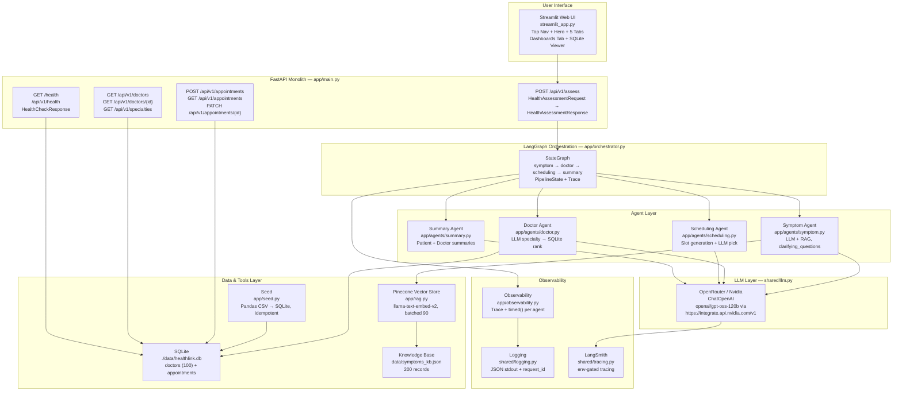
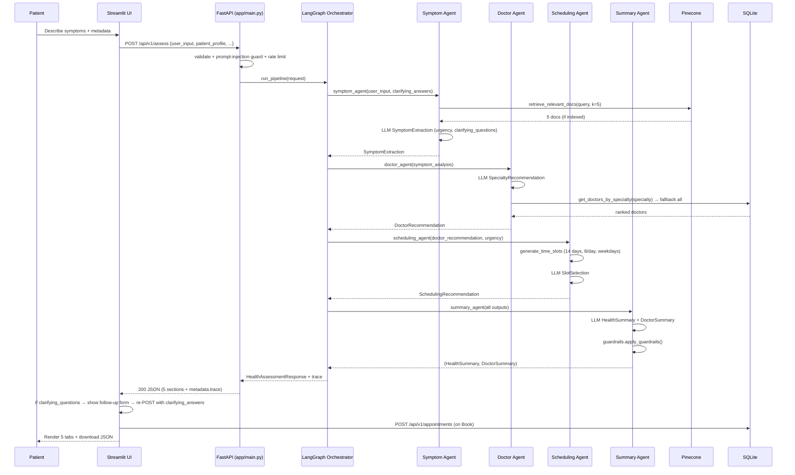
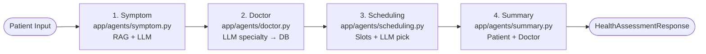
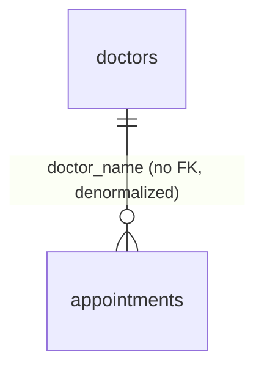
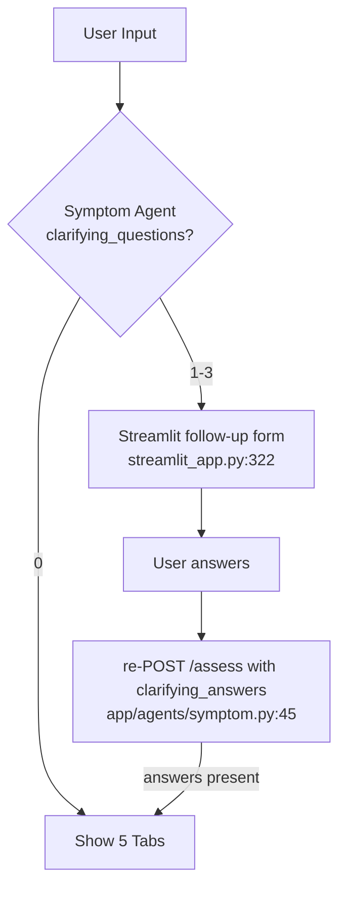

# HealthLink System Architecture

## Overview

HealthLink is an AI-powered multi-agent health orchestration system. It uses a **LangGraph `StateGraph` sequential orchestration layer** to understand patient concerns in natural language, retrieve contextual medical knowledge via RAG, reason across specialized agents, and generate contextual summaries for both patients and doctors.

The system provides one primary interface:

-   **Streamlit Web UI** — modern webpage (no sidebar) with top nav, hero, 4-step strip, dashboards tab, SQLite viewer, assessment form, and 5 result tabs

Data is stored in a **SQLite database** (`./data/healthlink.db`) with doctors (seeded from `data/doctors.csv`) and appointments (booked at runtime). Unstructured medical knowledge (`data/symptoms_kb.json`, 200 records) is indexed in a **Pinecone serverless vector store** with built-in embeddings (`llama-text-embed-v2`) for semantic retrieval.

---

## Table of Contents

- [Key Features](#key-features)
- [System Diagram](#system-diagram)
- [Data Flow](#data-flow)
- [Orchestrator Workflow](#orchestrator-workflow)
- [Component Descriptions](#component-descriptions)
- [Database Schema](#database-schema)
- [RAG Architecture](#rag-architecture)
- [Clarifying Loop](#clarifying-loop)
- [LLM Configuration](#llm-configuration)
- [Startup Behaviour](#startup-behaviour)

---

## Key Features

### LangGraph StateGraph Orchestration

Four agents run in a strict sequence via `app/orchestrator.py` (`StateGraph`): `symptom → doctor → scheduling → summary`. Each node reads typed `PipelineState` and writes its Pydantic output, preserving workflow integrity and enabling per-step latency tracing.

### Monolithic FastAPI Service

Although conceptually multi-agent, **all agents run inside a single FastAPI service** (`app/main.py`). Endpoints: `POST /api/v1/assess`, `GET /api/v1/doctors`, `POST /api/v1/appointments`, `GET /health` + `/api/v1/health`. This simplifies debugging, deployment, and CI/CD (single Docker image `python:3.13-slim`).

### Clarifying Questions Loop

Symptom agent (`app/agents/symptom.py`) emits up to 3 `clarifying_questions` when input is vague. Streamlit (`streamlit_app.py`) shows a follow-up form, re-POSTs with `clarifying_answers`, and the agent suppresses further questions on the second turn (no infinite loop).

### Guardrails & PII Safety

- **Input:** `app/security.py` — length + `<script`/`javascript:` check, prompt-injection heuristics (`ignore previous instructions`), PII masking for logs, sliding-window rate limiter (`RATE_LIMIT_MAX=0` = unlimited).
- **Output:** `app/guardrails.py` — scans `HealthSummary` for definitive diagnosis, harmful advice, PII; softens or removes flagged text and enforces disclaimer.

### Modern Web UI

Top nav (brand + Swagger/ReDoc/Health/LangSmith/Pinecone + Wake API pill), gradient hero, 4-step airy cards, `Dashboards & Data` tab, and `🗄️ SQLite Viewer` — no sidebar, `Inter` + `Plus Jakarta Sans`, sticky header handling for logo visibility.

---

## System Diagram



---

## Data Flow



---

## Orchestrator Workflow

### Full Pipeline (Sequential)



Each edge is a `StateGraph` transition; `PipelineState` carries `request`, `symptom_analysis`, `doctor_recommendation`, `scheduling_recommendation`, `health_summary`+`doctor_summary`, and `Trace`.

### Task Context Dependencies

| Task | Reads From | Writes To |
|------|------------|-----------|
| `symptom` | `request.user_input`, `clarifying_answers`, RAG | `symptom_analysis` |
| `doctor` | `symptom_analysis` + `preferred_location` | `doctor_recommendation` |
| `scheduling` | `doctor_recommendation`, `urgency`, `preferred_date` | `scheduling_recommendation` |
| `summary` | all three prior outputs | `health_summary` + `doctor_summary` |

---

## Component Descriptions

### Entry Points

| Component | File | Responsibility |
|-----------|------|----------------|
| Web UI | `streamlit_app.py` / `spaces/app.py` | Modern webpage, form + clarifying loop, 5 tabs, booking, dashboards tab, SQLite viewer, Wake API pill |
| API | `app/main.py` | FastAPI monolith, lifespan seeding, health dual-route, assess with guardrails, appointments CRUD |
| Config | `shared/config.py` | `Settings` from `.env` (6 required + 25 optional defaults) |
| LLM Factory | `shared/llm.py` | `LLMClient` via `ChatOpenAI` (OpenRouter/Nvidia), `llm_generate` + text fallback, `max_tokens=0` = unlimited |

### Agent Layer

| Component | File | Responsibility |
|-----------|------|----------------|
| Symptom Agent | `app/agents/symptom.py` | RAG retrieval, extracts `SymptomExtraction` with `clarifying_questions` (suppressed on 2nd turn) |
| Doctor Agent | `app/agents/doctor.py` | `SpecialtyRecommendation` via LLM, `ilike` search, rating sort, fallback to all |
| Scheduling Agent | `app/agents/scheduling.py` | `generate_time_slots` (weekdays, 8 slots/day), `SlotSelection` via LLM |
| Summary Agent | `app/agents/summary.py` | `HealthSummary` + `DoctorSummary` via 2 LLM calls, then `apply_guardrails` |

### Data Layer

| Component | File | Responsibility |
|-----------|------|----------------|
| DB Manager | `app/database.py` | `DatabaseManager` (SQLite vs Postgres pooling), `session_scope`, `reset_db_manager` with `engine.dispose()` |
| Doctors Table | `app/database.py:24` | `DoctorModel` (100 rows, 13 cols) |
| Appointments Table | `app/database.py:43` | `AppointmentModel` (book/list/cancel) |
| Seed | `app/seed.py` | `load_doctors_csv` via Pandas, idempotent `seed_doctors` |
| RAG Store | `app/rag.py` | Hybrid: `VectorStore` (Pinecone batched 90) + `BM25Okapi` (in-memory, `k1=1.5/b=0.75`) + `RRF` (`top-10+top-10→top-5`, `k=60`), `data/_chunks.json`, idempotent |

### Security & Observability

| Component | File | Responsibility |
|-----------|------|----------------|
| Security | `app/security.py` | `validate_user_input` (10–5000, `<script` check), `detect_prompt_injection`, `mask_pii`, `RateLimiter` (`0` = unlimited) |
| Guardrails | `app/guardrails.py` | `scan_text`/`soften_text`/`scan_summary`/`apply_guardrails` for diagnosis/PII/harmful |
| Observability | `app/observability.py` | `Trace` + `timed()` per agent, logged via `shared/logging.py:69` `log_step` |
| Logging | `shared/logging.py` | `JsonFormatter` with `request_id` ContextVar, stdout JSON for GCP |
| Tracing | `shared/tracing.py` | `configure_langsmith` mirrors `LANGCHAIN_*` env; `tracing_enabled()` |

---

## Database Schema

SQLite (`./data/healthlink.db`):

| Table | Description |
|-------|-------------|
| `doctors` | 100 seeded doctors: `id, name, specialty, experience_years, rating, availability, location, email, phone, qualifications, languages, consultation_type, created_at` |
| `appointments` | Bookings: `id, user_id, doctor_name, specialty, appointment_date, appointment_time, status, reminder, notes, created_at` |



Seed: `data/doctors.csv` → `app/seed.py` on `lifespan` (`app/main.py:72`).

---

## RAG Architecture

Hybrid: Pinecone vector (built-in `llama-text-embed-v2`, batched 90) + BM25 keyword (in-memory `BM25Okapi`) + RRF fusion (`k=60`).

```
data/symptoms_kb.json (200 JSON records)
    │
    ▼
build_record_content() + chunk_text(500/50)
    │
    ├──► pc.inference.embed(llama-text-embed-v2, passage) batched 90 ──► Pinecone Index healthlink (1024, cosine) ──► top-10 vector
    │
    └──► _build_bm25() → BM25Okapi (k1=1.5) + data/_chunks.json ──► top-10 keyword
                            │
                            ▼
              _rrf_fuse(vector top-10 + bm25 top-10, k=60) → top-5 fused → format_retrieval_context() → LLM CONTEXT
```

- **Idempotency:** `vector_count()>0` + `BM25` loaded from `data/_chunks.json` (`app/rag.py:180`); re-index only if both missing.
- **Chunk count:** ~200 docs (1 per record).
- **Failure modes:** `vector_search` fallback → BM25-only; `BM25` miss → vector-only; `retrieve_relevant_docs` logs `Hybrid retrieved X docs (vector Y + bm25 Z)`; `load_knowledge_base` batched 90 avoids 96-limit.

---

## Clarifying Loop



- First turn may emit 3 Qs (vague input like `fever like few days` → `medium` + 3 Qs).
- `streamlit_app.py` tracks `clarifying_done` to avoid infinite loop.
- `app/agents/symptom.py:88` forces `clarifying_questions=[]` on second turn if `clarifying_answers` present.

---

## LLM Configuration

### Provider Routing

| Env | Value | Effect |
|-----|-------|--------|
| `OPENROUTER_BASE_URL` | `https://openrouter.ai/api/v1` | OpenRouter — `sk-or-...` |
| `OPENROUTER_BASE_URL` | `https://integrate.api.nvidia.com/v1` | Nvidia host — `nvapi-...` |

`shared/llm.py:36` uses `ChatOpenAI(api_key=settings.openrouter_api_key, base_url=settings.openrouter_base_url, model=settings.openrouter_model)` — the var name is generic despite `OPENROUTER_` prefix; any `sk-or`/`nvapi` works if base URL matches. `AliasChoices` allows `OPENROUTER_MODEL` or legacy `LLM_MODEL_NAME`.

**Current `.env`:** `nvidia/nemotron-3-nano-30b-a3b` via `integrate.api.nvidia.com` (verified `83 models` listed, `llama-text-embed-v2` for Pinecone). Free fast alternatives: `liquid/lfm-2.5-2.6b:free`, `z-ai/glm-5.2:free`.

### Environment Variables (lean required)

| Variable | Required | Default |
|----------|----------|---------|
| `OPENROUTER_API_KEY` | Yes | — |
| `OPENROUTER_MODEL` | Yes | `openai/gpt-4o-mini` |
| `PINECONE_API_KEY` | Yes | — |
| `PINECONE_INDEX_NAME` | Yes | `healthlink` |
| `PINECONE_DIMENSION` | Yes | `1024` |
| `EMBEDDING_MODEL` | Yes | `llama-text-embed-v2` |
| `API_BASE_URL` | Yes (for UI) | `http://localhost:8000/api/v1` |

Optional tuning (defaults in `shared/config.py`): `LLM_TEMPERATURE=0.2`, `LLM_MAX_TOKENS=0` (unlimited), `RAG_TOP_K=5`, `DATABASE_URL`, `GCP_REGION`, etc. `0` for `RATE_LIMIT_MAX`/`LLM_MAX_TOKENS` means unlimited (handled in `app/security.py:71` and `shared/llm.py:41`).

### LangChain Calls

Standalone `ChatOpenAI` (not CrewAI) powers all 4 agents plus dashboard widgets — same `shared/llm.py:113` `llm_generate` path. LangSmith tracing is via `shared/tracing.py:24` `configure_langsmith()`.

---

## Startup Behaviour

1.  `shared/config.py` loads `.env` via `pydantic-settings`; `app/main.py:57` `get_settings()` is module-level.
2.  `shared/logging.py:43` `setup_logging()` + `shared/tracing.py:24` `configure_langsmith()` (env-gated).
3.  `app/main.py:72` `lifespan`: `seed_if_needed()` (Pandas CSV → SQLite, idempotent), then if `LOAD_KB_ON_STARTUP=true` → `load_knowledge_base()` (Pinecone, batched 90, idempotent via `vector_count`).
4.  `RateLimiter` is instantiated from `RATE_LIMIT_MAX`/`WINDOW`.
5.  `uvicorn` serves `app:app` on `127.0.0.1:8000`; Streamlit on `8501` reads `API_BASE_URL` via `load_dotenv()`.

---

## Limitations

### API Rate Limits
Free-tier OpenRouter/Nvidia and Pinecone free tier are rate-limited; 4 LLM calls + 1 embed per `POST /assess` can queue. `RATE_LIMIT_MAX=0` disables app-level limiting, not provider limits.

### Model Latency
`nvidia/nemotron-3-ultra-550b` → `~120-180s` per assess; `nano-30b` → `~35-40s`; `openai/gpt-4o-mini` → `~25s`. Free models vary.

### RAG Dependency
Without `data/symptoms_kb.json` indexed, `retrieve_relevant_docs` returns 0 docs (logged as warning) and LLM runs without context — quality drops. Government-scheme-style RAG is Pinecone-only, no BM25 hybrid.

### Vector Store
Pinecone serverless + BM25 in-memory hybrid; `FAISS` alternative from problem statement is superseded by BM25. Index dimension must match `EMBEDDING_MODEL` (1024 for `llama-text-embed-v2`).

